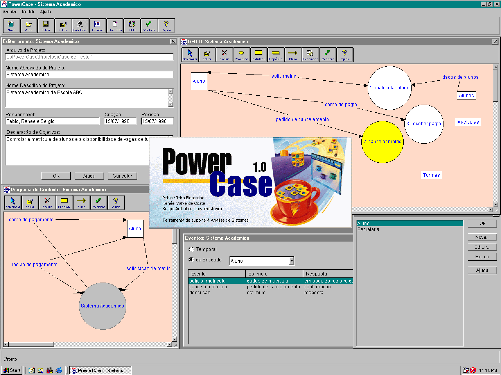

# PowerCase

PowerCase is graphical tool for systems analysis developed as a college project. It was written around summer 1998.

## Development

PowerCase was developed using Symantec Visual Cafe (possibly version 3) and Java 1.0 or 1.1. The interface prototype was built using Sybase PowerBuilder (possibly version 6.5). The actual implementation used the original Java Abstract Window Toolkit (AWT) with some elements from the Symantec libraries shipped with Visual Cafe.

## Installer

An installer created with InstallShield is available for 32-bit Windows systems (e.g. Windows 95, 98, XP).

## Authors

Pablo Vieira Florentino, Renée Valverde, Sergio de Carvalho